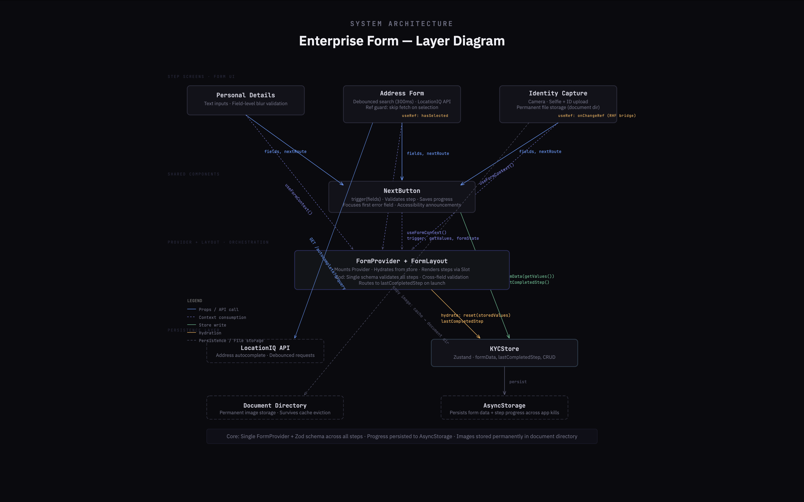

# Enterprise Form

A multi-step KYC form that spans multiple screens but shares a single validation schema and a single form state via FormProvider. Progress persists across app kills so users never lose their work.

## Architecture



The FormProvider is the core of this architecture. It centralizes form state across all screens and exposes methods that trigger validation when a value is entered and the input loses focus, and again when the user completes a step. The provider validates each field against a single Zod schema that covers all steps and focuses the first field with an error.

The form state must survive app kills so users can resume where they left off. To support this, a store for form values and step progress is persisted to AsyncStorage. The provider reads from this store and initializes the form state with `reset(storedValues)` when saved values exist. Each step's state is saved once it is considered valid. The FormLayout orchestrates the flow by wrapping the form screens with the provider, reading the last completed step, and routing the user to the appropriate screen.

Captured images are stored in the device's cache directory and may be cleared by the OS. This can invalidate the image URI saved in AsyncStorage if the user returns later. To mitigate this, the captured image is copied to a permanent document directory using expo-file-system, reducing the risk of a missing file. Image capture also requires a different JSX branch (the camera view), so the `onChange` function from the form Controller is stored in a ref (`onChangeRef`) to bridge the camera's capture result back to the form field.

Addresses can be long and often include suggestions. The local state for the address text input is tracked for changes, and its value is passed to a debounce function that waits 300ms before using it as a search query for the LocationIQ Address API. When an address is selected, the local state is updated with the new value. To prevent the debounce function from being triggered by this programmatic update, a ref (`hasSelected`) is used to track whether the user has made a selection before firing the search.

## Installation

### Prerequisites

- Node.js v22 or higher

### Install dependencies

```bash
npm install
```

### Run the project

This project uses Expo and works with both Expo Go and development builds:

```bash
npx expo start
```

## What I Learned

- **Centralized Multi-Step Validation** — Building this project, I learned how to handle cross-field validation using one Zod schema across all steps with `trigger(fields)` calls instead of separate forms per screen. This made persistence trivial — one schema, one form state, one store.

- **Bridging JSX Branches with Refs** — The identity capture screen pushed me to figure out how to connect the camera's captured result back to a form Controller that lived in a different JSX branch. Using `onChangeRef` as a bridge let the camera view update form state without being wrapped in the Controller.

- **React Hook Form Internals** — I studied how React Hook Form handles state changes under the hood, using refs so it doesn't trigger re-renders on every keystroke — only when validation runs and errors are present.

## Known Limitations

This project doesn't include a review screen. In a production app, a review step is needed so the user can cross-check their details before submission and navigate back to any step to make corrections.

## Tech Stack

- React Native (Expo)
- Expo Router
- React Hook Form
- Zod
- Zustand
- AsyncStorage
- expo-camera
- expo-file-system
- LocationIQ API

## License

MIT
